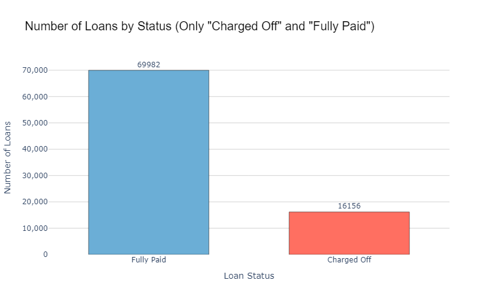

  

<h1 align="center">Machine Learning Project : 
 Loans Default Prediction with Bagging Classifier  </h1>

  <table> 
    <tr>
      <td align="center">
        
         
        <strong>Solal Fuster 72950</strong>
      </td>
      <td align="center">
        
         
        <strong>Mael Thuillier 79372</strong>
      </td>
      <td align="center">
        
         
        <strong>Grigory Sheleg 80985</strong>
      </td>
      <td align="center">
        
         
        <strong>Philippe de Parcevaux 80667</strong>
      </td>
    </tr>
  </table>

---
 

  

       

🤖 This project develops a predictive model to estimate the probability of a loan default. By following a structured data processing pipeline, feature selection, model selection, and tuning, the project provides insights and recommendations for the best model and optimal hyperparameters. 🤖
      

<h6> 
 
This readme is a summary of the notebook "Loan Default", we are not answering all the questions of the assignment. To have a full understanding of our work and access all our answers for the assignement we advise you to consult the notebook. 

## 📝 Table of Contents

- [Introduction](#🧐-introduction)
- [Project Overview](#📋-project-overview)
- [Results achieved](#🚀-results-achieved)
- [Data Preparation and Preprocessing](#💭-data-preparation-and-preprocessing)
- [Model Training and Evaluation without Feature Engineering](#🤖-model-training-and-evaluation-without-feature-engineering)
- [Top 3 Best-Performing Models](#🌟-top-3-best-performing-models)
- [Gradient Boosting vs. AdaBoost Fine Tuning](#🔍-gradient-boosting-vs-adaboost-fine-tuning)
- [Feature Engineering](#✨-feature-engineering)
- [Best Model: Bagging Classifier](#🏆-best-model-bagging-classifier)
- [Repository Structure](#🗂️-repository-structure)
- [Authors](#✍️-authors)

## <b> 🧐 Introduction
In this case study, we aim to create a robust predictive model for loan default probability.
Indeed, there is sometimes a possibility that a __loan__ might be given to a person who might not be able to return it to the bank or __vice-versa__. It becomes important for banks to understand the behavior of the __customer__ before they can take action to lend money to people for different purposes. 

Our coursework consists of a single case study in which we seek to build the best model we can to predict the __default__ of a loan. These are peer-to-peer loans covering the period from __2007-2017__ and have been provided by Lending Club. We need to predict the label ‘loan status’ having a value called ‘__charge-off__’ ; a charge-off refers to debt that a company believes it will no longer collect as the borrower has become delinquent on payments.

## <b>📋 Project Overview

- **Goal**: To predict the likelihood of a loan default using a dataset containing both numerical and categorical features.
- **Deliverables**: A trained model, selection of features, insights into feature importance, and an evaluation of model performance metrics.
- **Bonus**: We decided to perform feature engineering to go further in the assignement and improve model prediction.

## <b>🚀 Results Achieved
The best model we have found is the __Bagging Classifier after Grid Search, hyper tuning and feature engineering__,
compared to all other models we looked at.  
### <b> 📈 ROC Curve: 

### <b> 📐 Confusion Matrix of our model :

### <b> 📊 Classification Report :

| Metric         | Precision | Recall | F1-Score | Support |
|----------------|-----------|--------|----------|---------|
| **Class 0**    | 0.96      | 0.90   | 0.93     | 1110    |
| **Class 1**    | 0.91      | 0.96   | 0.93     | 1090    |
| **Accuracy**   |           |        | **0.93** | 2200    |
| **Macro Avg**  | 0.93      | 0.93   | 0.93     | 2200    |
| **Weighted Avg** | 0.93    | 0.93   | 0.93     | 2200    |

- **Accuracy**: 0.93  
- **Macro Average**: Averages metrics equally across classes.
- **Weighted Average**: Averages metrics weighted by class support size.
- **AUC** : 0.979

## <b>💭 Data Preparation and Preprocessing 

### 1. Loading Libraries and Dataset

Necessary Python libraries are imported, including `pandas`, `numpy`, `sklearn`, and `category_encoders`.  
The dataset is loaded, containing a mix of 150 numerical and categorical features for 100k observations . 
Initial warnings are disabled for a smoother workflow. 

### <b> 2. Preparing the Target Variable

- **Target**: `loan_status`, indicating whether a loan is fully paid or has defaulted.
- **Encoding**: The target variable is encoded as a binary feature (1 for default, 0 for fully paid).

### <b> 3. Exploratory Data Analysis (EDA)

You can find some key insights below, part of the results we get from our exploratory data analysis (EDA). 

* A __large portion__ of our data contains __missing values__.
* The __number of people__ who defaulted on a loan is  __lower__ than the number of people who fully paid their loan. 81.24 vs 18.76% 
Therefore, __class balancing__ will be done. 
* Based on the salary amounts, a large portion of people has salaries ranging from __$45,000__ to __$90,000__. There are also a few people who make more than __$250,000__ but they are outliers in the data, and will be removed.
* A large number of people have taken a loan ranging from __$1,000__ to __$35,000__.   

### <b> 4. Feature Selection and Dimensionality Reduction

To optimize model training and minimize computational overhead, we selectively reduce the feature set:
   - **Features with Missing Values**: Columns with more than a set threshold of missing values are eliminated (>30%).
   - **Low-Relevance Features**: Features lacking intuitive or predictive relevance are excluded based on domain knowledge.
   - **Highly Correlated Features**: Using a correlation matrix, features with low correlation with Target (<3%) are removed.

### 5. High-Cardinality Feature Handling

The dataset contains a categorical feature (`zip_code`) with over 200 unique values. This feature is transformed by grouping them according to the first number of their zip-code. 
As zip-code are grouped by region in the USA (https://en.wikipedia.org/wiki/ZIP_Code#Geographic_hierarchy) 

We used label encoding for other categorical features that could be of interest.

<h3> <b> 👉 After feature selections we ended with 32 features </h3>
 

## <b> 🤖 Model Training and Evaluation without Feature Engineering.

### 1. Selection of models
We use K-Folds cross validation with 10 folds and 'roc-auc' to prevent overfitting and improve the models scores

We experiment with multiple models, including:

- **Logistic Regression (LR)**: Baseline model for linear separability.
- **K-Nearest Neighbors (KNN)**: A distance-based model useful for capturing local patterns.
- **Decision Tree (DT)**: To capture non-linear relationships and interpretability.
- **Gaussian Naive Bayes (NB)**: Probabilistic model that assumes feature independence.
- **Neural Network (NN)**: Multilayer Perceptron classifier for capturing complex patterns.
- **AdaBoost (AB)**: A boosting method that combines weak learners iteratively to improve accuracy.
- **Random Forest (RF)**: An ensemble method that reduces variance and overfitting.

Additional classifiers considered:

- **Ridge Classifier (Ridge)**: A regularized linear classifier to handle multicollinearity.
- **Stochastic Gradient Descent (SGD)**: Optimizes the objective function iteratively, suitable for large datasets.
- **Passive-Aggressive Classifier (PAC)**: Updates its weights only when classification is incorrect.
- **Perceptron**: A basic single-layer neural network model.
- **Extra Tree Classifier (ETC)**: A single decision tree classifier, often used in ensemble methods.
- **Bernoulli Naive Bayes (BNB)**: Naive Bayes variant for binary features.
- **Support Vector Classifier (SVC)**: Separates data points using a hyperplane for classification tasks.
- **Linear Support Vector Classifier (LinearSVC)**: Linear variant of SVC.
- **Nu-Support Vector Classifier (NuSVC)**: Variant of SVC with parameter constraints.
- **Gradient Boosting (GBM)**: A boosting model that sequentially builds weak learners.
- **Bagging Classifier (BC)**: Reduces variance by training multiple models on subsets of data.
- **Extra Trees Classifier (ETC)**: An ensemble of decision trees for reducing bias and variance.
- **Histogram-Based Gradient Boosting (HGB)**: Faster gradient boosting using histograms to handle numerical features efficiently.
- **Stacking Classifier**: Combines multiple models, including Random Forest, Gradient Boosting, AdaBoost, and SVC, in a meta-learner ensemble.

Each model is evaluated to identify the best-performing approach for our data, leveraging both base and ensemble methods to maximize predictive accuracy.

### 2. First results
#### After running each model on each fold we selected the top 3 models according to ROC-AUC Score :

 

## <b>🌟 Top 3 Best-Performing Models

### 1. **Gradient Boosting Classifier**
   - **Mean ROC-AUC Score**: 0.9406
   - **Best Hyperparameters**:
     - `subsample`: 0.9
     - `n_estimators`: 100
     - `min_samples_split`: 10
     - `min_samples_leaf`: 2
     - `max_depth`: 5
     - `learning_rate`: 0.1
   - **Performance Summary**:
     - Gradient Boosting  captures non-linear relationships and iteratively improves model accuracy. We achieved a high ROC-AUC score

### 2. **Stacking Classifier**
   - **Mean ROC-AUC Score**: 0.9396
   - **Model Composition**:
     - Random Forest
     - Gradient Boosting
     - AdaBoost
     - Support Vector Classifier (SVC)
   - **Performance Summary**:
     - By combining multiple classifiers, the Stacking Classifier leverages the strengths of each model, providing a balanced and robust approach. We achieved excellent ROC-AUC scores.
     - It gives the same mean ROC-AUC score with regards to the AdaBoost Classifier.

### 3. **AdaBoost Classifier**
   - **Mean ROC-AUC Score**: 0.9386
   - **Best Hyperparameters**:
     - `algorithm`: SAMME.R
     - `learning_rate`: 0.5
     - `n_estimators`: 70
   - **Performance Summary**:
     - AdaBoost iteratively focuses on misclassified instances, improving classification accuracy over time. It ranked among the top models for predicting loan defaults.

---

## <b>🔍 Gradient Boosting vs. AdaBoost Fine Tuning

We choosed to continue the project with `AdaBoost Classifier` and `Gradient Boosting Classifier`.
Althoug Stacking Classifier was slightly better than AdaBoost, it would have take long time to tune it and we don't have the computational power to do so. 

We performed hyperparameter tuning using `RandomizedSearchCV` for the **Gradient Boosting Classifier** and `GridSearchCV` for the **AdaBoost Classifier** to optimize each model's performance based on the ROC-AUC scoring metric. Below are the best parameters, ROC-AUC scores, and a final selection of the most effective model for predicting loan defaults.

### <b>🌟 Gradient Boosting Classifier
- **Best Parameters**:
  - `n_estimators`: 100
  - `learning_rate`: 0.1
  - `max_depth`: 5
  - `min_samples_split`: 10
  - `min_samples_leaf`: 2
  - `subsample`: 0.9
- **Best ROC-AUC Score**: 0.9406
- **Performance Summary**:
  - The Gradient Boosting model achieved the highest ROC-AUC score, indicating strong predictive power and the ability to capture complex, non-linear relationships in the data.

### <b>🌟 AdaBoost Classifier
- **Best Parameters**:
  - `n_estimators`: 70
  - `learning_rate`: 0.5
  - `algorithm`: SAMME.R
- **Best ROC-AUC Score**: 0.9357
- **Performance Summary**:
  - AdaBoost performed well with a competitive ROC-AUC score. By iteratively. Although it was not as high-scoring as Gradient Boosting, it offers an efficient alternative with simpler tuning parameters.

### <b> 🏆 Selected Model: Gradient Boosting Classifier
The **Gradient Boosting Classifier** is chosen as the best model due to its higher ROC-AUC score of 0.9406, indicating a more robust ability to distinguish between default and non-default loans. 

## ✨ Feature Engineering

To enhance our model's predictive accuracy, we created additional features based on existing data. These engineered features help capture deeper insights into borrowers' financial behaviors, risk factors, and credit utilization patterns.   
Below is a description of each engineered feature:

### 1. **Overall Credit Utilization (`overall_credit_utilization`)**
   - **Definition**: Average utilization rate across all revolving and bankcard accounts.
   - **Calculation**: `(revol_util + bc_util) / 2`, where:
     - `revol_util`: Revolving line utilization rate.
     - `bc_util`: Bankcard utilization rate.
   - **Purpose**: It provides a consolidated view of credit utilization, offering a more comprehensive understanding of the borrower's debt usage. High utilization can signal financial stress, while lower values suggest responsible credit management.

### 2. **Payment to Loan Ratio (`payment_to_loan_ratio`)**
   - **Definition**: Ratio of the latest payment amount to the original loan amount.
   - **Calculation**: `last_pymnt_amnt / loan_amnt`, where:
     - `last_pymnt_amnt`: Last payment amount made by the borrower.
     - `loan_amnt`: Original loan amount.
   - **Purpose**: It assesses the borrower’s repayment effort relative to the loan size. A high ratio may indicate proactive debt reduction, while a low ratio could imply potential repayment difficulties.

### 3. **State Risk (`state_risk`)**
   - **Definition**: Average loan default rate for each state.
   - **Calculation**: Each state is mapped to its average default rate based on historical data.
   - **Purpose**: It captures geographic risk factors by incorporating state-level economic influences. Some states have higher default rates, which can provide predictive insight into location-based risk.

### 4. **Revolving Account Span (`revolving_account_span`)**
   - **Definition**: Time span of the borrower’s revolving account activity.
   - **Calculation**: `mo_sin_old_rev_tl_op - mo_sin_rcnt_rev_tl_op`, where:
     - `mo_sin_old_rev_tl_op`: Months since the oldest revolving trade line.
     - `mo_sin_rcnt_rev_tl_op`: Months since the most recent revolving trade line.
   - **Purpose**: It helps assess the borrower’s credit activity over time, with a longer span possibly indicating stable account management, while shorter spans may suggest recent credit line usage.

### 5. **Average Balance per Account (`avg_bal_per_account`)**
   - **Definition**: Average balance per open account.
   - **Calculation**: `avg_cur_bal / (open_acc + 1)`, where:
     - `avg_cur_bal`: Average current balance across accounts.
     - `open_acc`: Number of open accounts.
     - `+1` is added to avoid division by zero.
   - **Purpose**: It reflects the borrower's average debt load per account, indicating financial spread and stability. Lower values may suggest responsible debt management, while higher values could indicate over-leverage.

## 🏆 Best Model: Bagging Classifier

After performing hyperparameter tuning with **GridSearchCV** across multiple models, the **Bagging Classifier** emerged as the top-performing model based on the ROC-AUC score. Below is a summary of the performance and configuration of the Bagging Classifier, along with the rationale for selecting it as the best model.

### Model Performance Summary

- **Bagging Classifier Best ROC-AUC Score**: 0.9790
- **Best Parameters**:
  - `n_estimators`: 200
  - `max_samples`: 1.0
  - `max_features`: 0.7
  - `bootstrap`: False
  - `bootstrap_features`: True

### <b> Final Selection </b>

The Bagging Classifier achieved the highest ROC-AUC score of **0.9790** during cross-validation, outperforming other models like the Gradient Boosting Classifier and AdaBoost.

## 🗂️ Repository Structure

- **`LoanDefaultProbability_STUDENT_V1.ipynb`**: Jupyter notebook containing the complete analysis and model development workflow.
- **`README.md`**: Project summary, methodology, results, and documentation for replication or extension.
- **`png`**: Graphs used inside the readme.
- **`requirements.txt`**: List of the libraries used.

## ✍️ Authors

- [@Solal Fuster](https://github.com/Unbexium)
- [@Mael Thuillier](https://github.com/slag-m)
- [@Grigory Sheleg](https://github.com/BrozerDu57)
- [@Philippe de Parcevaux](https://github.com/Bunkersleet)

 
 
 

<h1> 

 END
